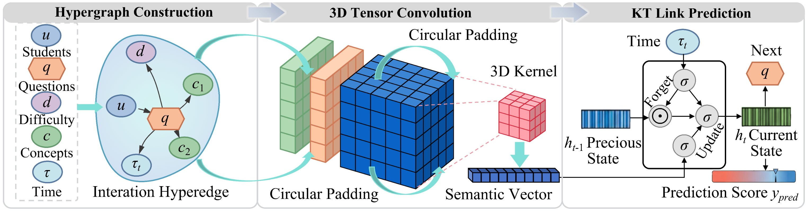

<p align="center">
  
</p>

<h1 align="center">HyConvKT: Hypergraph Convolutional Neural Networks for Knowledge Tracing</h1>

<p align="center">
  <a href="https://www.python.org/downloads/release/python-390/"></a>
  <a href="https://pytorch.org/"></a>
  <a href="data/LICENSE"></a>
</p>

<p align="center">
  <b>Hypergraph convolution with 3D circular convolution for high-order feature interaction<br>and context-aware dynamic knowledge state evolution.</b><br><br>
  Achieves AUC of <b>0.7931</b> on ASSISTments2015, <b>0.8401</b> on Algebra2005, and <b>0.7369</b> on DBE-KT22,<br>
  outperforming <b>17 state-of-the-art</b> knowledge tracing models.
</p>

---

## Overview

Knowledge Tracing (KT) dynamically infers students' cognitive states from historical interaction sequences. Existing methods represent heterogeneous features as binary relations, failing to capture implicit high-order couplings among students, questions, concepts, and contextual attributes.

**HyConvKT** addresses this with three complementary modules:

| Module | Code | Role |
|--------|------|------|
| **Hypergraph Link Prediction** | `models/hypergraph.py` | Constructs multi-ary hyperedges integrating students, questions, concepts, difficulty, type, and time; aggregates high-order neighborhood via 3D circular convolution |
| **3D Circular Convolution** | `models/conv3d.py` | Performs explicit high-order feature interaction in tensor space with SE channel attention and node attention aggregation |
| **Context-Aware State Evolution** | `models/hyconvkt.py` | GRU-like gating with forgetting mechanism that models temporal knowledge decay and state transitions |

Experimental evaluations demonstrate:
- **0.7931 AUC** on ASSISTments2015 (+2.19pp over HCMKT, the strongest baseline)
- **0.8401 AUC** on Algebra2005 (+0.25pp over FlucKT)
- **0.7369 AUC** on DBE-KT22 (+0.74pp over DTransformer)
- Consistent gains across all three datasets with statistical significance (paired Wilcoxon test, $p < 0.05$)

---

## Installation

```bash
# Clone the repository
git clone https://github.com/KGKT17/HyConvKT.git
cd HyConvKT

# Install dependencies
pip install -r requirements.txt
```

**Requirements:** Python 3.9+, PyTorch 1.13+, CUDA-capable GPU (recommended)

Key dependencies:

| Package | Version | Purpose |
|---------|---------|---------|
| `torch` | >= 1.13.0 | Deep learning framework |
| `numpy` | >= 1.22.0 | Numerical operations |
| `pandas` | >= 1.4.0 | Data loading and preprocessing |
| `scikit-learn` | >= 1.0.0 | AUC/ACC evaluation metrics |
| `tqdm` | >= 4.64.0 | Training progress bars |
| `pyyaml` | >= 6.0 | Configuration file parsing |
| `matplotlib` | >= 3.6.0 | Visualization |

---

## Quick Start

Train and evaluate HyConvKT on XES3G5M in under 5 minutes:

```bash
# 1. Preprocess data (if you have raw XES3G5M)
python run.py --mode preprocess

# 2. Train the model
python run.py --mode train

# 3. Evaluate
python run.py --mode test
```

---

## Dataset Preparation

### Supported Datasets

| Dataset | Learners | Questions | KCs | Interactions | Description |
|---------|----------|-----------|-----|-------------|-------------|
| **ASSISTments2015** | 4,151 | 100 | 100 | 853,601 | High school math exercises |
| **Algebra2005** | 574 | 173,113 | 112 | 884,102 | Algebra response records |
| **DBE-KT22** | 8,047 | 12,199 | 100 | 5,489,967 | Cross-disciplinary exercises |
| **XES3G5M** | -- | 999 | 99 | -- | Math exercises (Chinese) |

### Data Structure

```
data/
├── xes3g5m/
│   ├── train_valid_sequences.csv   # pyKT-format training data
│   ├── test.csv                    # pyKT-format test data
│   ├── cid_map.txt                 # Concept ID mapping
│   └── qid_map.txt                 # Question ID mapping
├── assist2015/                     # (download separately)
├── algebra2005/                    # (download separately)
└── dbe_kt22/                       # (download separately)
```

**XES3G5M preprocessing:**
```bash
# Place raw XES3G5M/train_valid_sequences.csv in the project root
python run.py --mode preprocess
```

**Other datasets:** Download from original sources and place in `data/` following the pyKT format. See [pyKT documentation](https://pykt.org/) for details.

---

## Usage

### Training

```bash
python run.py --mode train --config configs/config.yaml
```

### Evaluation

```bash
python run.py --mode test --checkpoint checkpoints/hyconvkt_best.pth
```

### Ablation Study

```bash
python run.py --mode ablation
```

### All CLI Arguments

| Argument | Default | Description |
|----------|---------|-------------|
| `--mode` | `train` | `train`, `test`, `ablation`, or `preprocess` |
| `--config` | `configs/config.yaml` | Path to YAML configuration |
| `--checkpoint` | `checkpoints/hyconvkt_best.pth` | Checkpoint path for testing |

### Configuration

All hyperparameters are managed in `configs/config.yaml`:

```yaml
model:
  embedding_dim: 64        # D: 8x8 = 64
  kernel_size: [3, 3, 3]   # 3D convolution kernel
  conv_channels: 32         # Number of convolution channels
  dropout: 0.2

training:
  batch_size: 32
  learning_rate: 0.001
  epochs: 200
  patience: 50
```

---

## Results

**Summary:** HyConvKT achieves the best AUC on all three benchmark datasets, with statistically significant improvements over the strongest baselines (paired Wilcoxon signed-rank test).

### Table 1: Overall Performance Comparison (AUC)

| Model | ASSISTments2015 | Algebra2005 | DBE-KT22 |
|-------|:---------------:|:-----------:|:--------:|
| DKT | 0.7254 | 0.8052 | 0.6805 |
| DKT+ | 0.7281 | 0.8085 | 0.6852 |
| DKVMN | 0.7305 | 0.8104 | 0.6954 |
| Deep-IRT | 0.7328 | 0.8126 | 0.6987 |
| SAKT | 0.7452 | 0.8153 | 0.7056 |
| DTransformer | 0.7481 | 0.8188 | 0.7295 |
| simpleKT | 0.7513 | 0.8254 | 0.7165 |
| FoLiBiKT | 0.7627 | 0.8316 | 0.7239 |
| SAINT | 0.7651 | 0.8255 | 0.7258 |
| AKT | 0.7661 | 0.8306 | 0.7225 |
| DIKT | 0.7689 | 0.8338 | 0.7187 |
| FlucKT | 0.7702 | 0.8376 | 0.7211 |
| HCMKT | 0.7712 | 0.8302 | 0.7205 |
| **HyConvKT** | **0.7931** | **0.8401** | **0.7369** |

### Table 2: Cold-Start Robustness (AUC on ASSISTments2015)

| Model | Cold (<50) | Normal (50-200) | Active (>200) |
|-------|:----------:|:----------------:|:-------------:|
| DKT | 0.6452 | 0.7112 | 0.7358 |
| SAINT | 0.6725 | 0.7456 | 0.7784 |
| AKT | 0.6819 | 0.7479 | 0.7823 |
| ATKT | 0.6850 | 0.7420 | 0.7650 |
| HCMKT | 0.6825 | 0.7517 | 0.7863 |
| **HyConvKT** | **0.7048** | **0.7533** | **0.7921** |

### Table 3: Ablation Study (AUC)

| Variant | ASSISTments2015 | Algebra2005 | DBE-KT22 |
|---------|:---------------:|:-----------:|:--------:|
| w/o Hypergraph | 0.7773 (↓1.99%) | 0.8270 (↓1.56%) | 0.7266 (↓1.40%) |
| w/o 3D-Interaction | 0.7810 (↓1.53%) | 0.8305 (↓1.14%) | 0.7246 (↓1.67%) |
| w/o Forgetting | 0.7879 (↓0.66%) | 0.8356 (↓0.54%) | 0.7315 (↓0.73%) |
| **HyConvKT (Full)** | **0.7931** | **0.8401** | **0.7369** |

---

## Hyperparameters

| Parameter | Value |
|-----------|-------|
| Embedding dimension ($D$) | 64 ($8 \times 8$ matrix) |
| 3D convolution kernel size | $3 \times 3 \times 3$ |
| Convolution channels | 32 |
| Maximum sequence length | 200 |
| Batch size | 32 |
| Optimizer | Adam |
| Learning rate | 0.001 |
| Weight decay ($L_2$) | 0.0001 |
| Dropout rate | 0.2 |
| Maximum epochs | 200 |
| Early stopping patience | 50 |

---

## Project Structure

```
HyConvKT/
├── README.md                    # This file
├── requirements.txt             # Python dependencies
├── .gitignore                   # Git ignore rules
├── run.py                       # Unified entry point (train/test/ablation/preprocess)
├── configs/
│   └── config.yaml              # All hyperparameters
├── data/
│   ├── __init__.py
│   ├── arc.png                  # Architecture diagram
│   ├── LICENSE                  # MIT License
│   ├── preprocess.py            # XES3G5M data preprocessing
│   └── dataset.py               # PyKT_Dataset, collate_fn, data loading
├── models/
│   ├── __init__.py
│   ├── conv3d.py                # CircularConv3d, SEBlock3D (3D circular convolution)
│   ├── hypergraph.py            # InteractionHyperedgeEncoder, NodeAttention
│   └── hyconvkt.py              # HyConvKT (full model with state evolution)
├── engines/
│   ├── __init__.py
│   ├── trainer.py               # Training loop with early stopping
│   └── evaluator.py             # Evaluation with AUC/ACC metrics
├── losses/
│   ├── __init__.py
│   └── loss.py                  # BCE loss for knowledge tracing
├── utils/
│   ├── __init__.py
│   ├── metrics.py               # AUC/ACC computation
│   ├── reproducibility.py       # Seed setting for reproducibility
│   └── logger.py                # Training logger
├── tools/
│   ├── __init__.py
│   └── visualization.py         # Knowledge state heatmap visualization
└── checkpoints/                 # Saved model weights (auto-created)
```

### File Descriptions

| File | Responsibility | Key Functions |
|------|---------------|---------------|
| `run.py` | CLI entry point | `run_train()`, `run_test()`, `run_ablation()`, `run_preprocess()` |
| `configs/config.yaml` | Configuration | All hyperparameters, data paths, training settings |
| `data/preprocess.py` | Data preprocessing | `process_xes3g5m()` — ID remapping, train/test split, windowing |
| `data/dataset.py` | Data loading | `PyKT_Dataset`, `collate_fn`, `load_pykt_data`, `get_difficulty_map` |
| `models/conv3d.py` | 3D convolution | `CircularConv3d`, `SEBlock3D`, `manual_circular_pad_3d` |
| `models/hypergraph.py` | Hyperedge encoder | `InteractionHyperedgeEncoder`, `NodeAttention` |
| `models/hyconvkt.py` | Full model | `HyConvKT` — encoder + GRU gating + prediction head |
| `engines/trainer.py` | Training engine | `Trainer` — epoch training with gradient clipping |
| `engines/evaluator.py` | Evaluation engine | `Evaluator` — AUC/ACC computation on validation/test sets |
| `losses/loss.py` | Loss function | `HyConvKTLoss` — BCE with logits |
| `utils/metrics.py` | Metrics | `compute_metrics()` — AUC, ACC |
| `utils/reproducibility.py` | Seeds | `set_seed()` — deterministic results |
| `utils/logger.py` | Logging | `Logger` — file + stdout logging |
| `tools/visualization.py` | Visualization | `visualize_knowledge_state()` — mastery heatmap |

---

## Citation

If you use this code or find our work useful, please cite:

```bibtex
@article{hyconvkt,
  title={Hypergraph Convolutional Neural Networks for Knowledge Tracing},
  year={2026}
}
```

---

## License

This project is licensed under the **MIT License**. See the [LICENSE](data/LICENSE) file for details.
